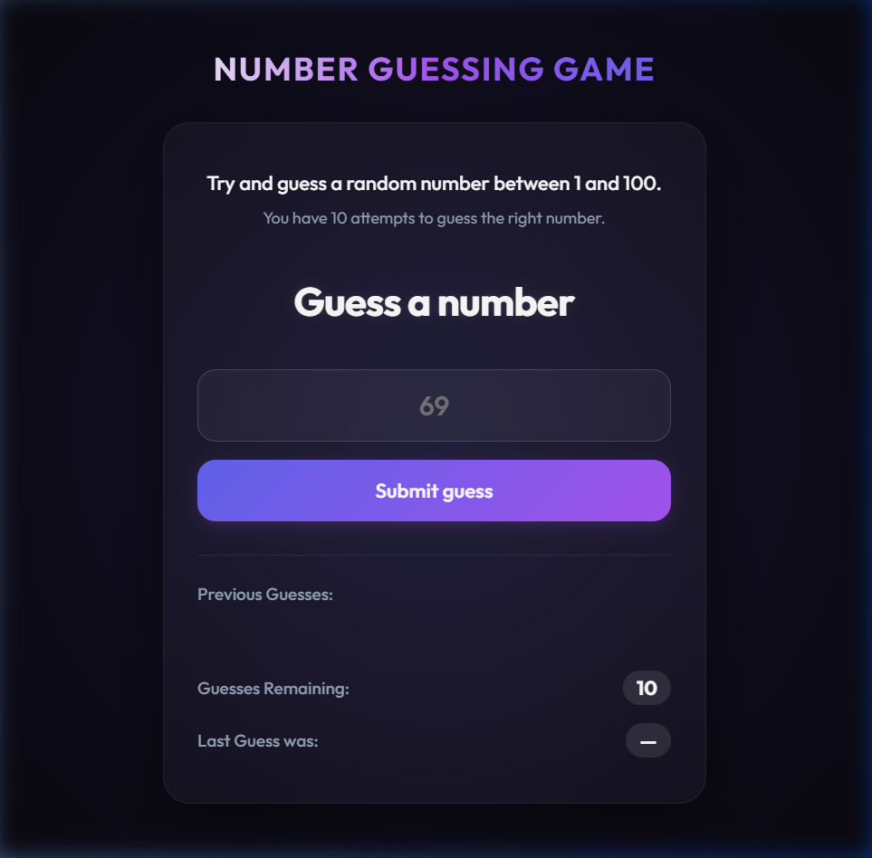

# 🎯 Premium Number Guessing Game

A beautifully designed, premium, and fully responsive **Number Guessing Game** built with vanilla HTML, CSS, and modern JavaScript. 



🚀 **Live Demo**: [Play Game Live Here](https://zerotwoishan.github.io/number-guessing-game/)

## ✨ Features

- **Glassmorphism UI**: High-end modern design using vibrant background gradients, card blurring (`backdrop-filter`), and clean typography.
- **Dynamic Visual Feedback**: Colors shift dynamically when a guess is too low (cyan hint) or too high (rose hint).
- **Interactive Experience**: Tactile feel with shake animations on wrong guesses, plus scale transitions on user interactions.
- **Stats Dashboard**: Keep track of remaining attempts and see the list of previous guesses rendered as modern visual pills.
- **Fully Responsive**: Optimized layout that scales beautifully across mobile, tablet, and desktop devices.
- **Accessible & Clean Code**: Semantic HTML, CSS custom variables, and standard JavaScript form handling.

## 🛠️ Technology Stack

- **Structure**: Semantic HTML5
- **Style**: Modern Vanilla CSS (using custom properties/variables and flexbox layouts)
- **Logic**: Vanilla ES6+ JavaScript

## 📂 File Structure

```text
number-guessing-game/
├── index.html   # Main layout and page structure
├── style.css    # Custom styling, animations, and typography
├── app.js       # Game logic, state management, and user interaction
├── preview.png  # Application screenshot/preview
└── README.md    # Documentation
```

## 🎮 How to Play

1. The game selects a random secret number between **1 and 100**.
2. Enter your guess in the input box and click **Submit guess** (or press Enter).
3. If your guess is incorrect:
   - You will see a hint indicating if the secret number is **High** or **Low**.
   - Your guess will be displayed as a visual pill tag under **Previous Guesses**.
   - The card will shake to indicate a wrong try, and your remaining guesses will decrease.
4. You have **10 attempts** to find the secret number.
5. Win the game by guessing the correct number before you run out of attempts!
6. Click **Play Again** to reset the game and start a new round with a new secret number.

## 🚀 How to Run Locally

Since this is a client-side web application, running it is incredibly simple:

1. Clone or download this repository.
2. Open `index.html` directly in any web browser.
3. *Alternative (Recommended)*: Use a local development server like **Live Server** in VS Code or run:
   ```bash
   npx serve .
   ```
